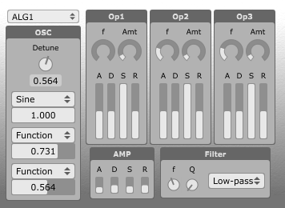
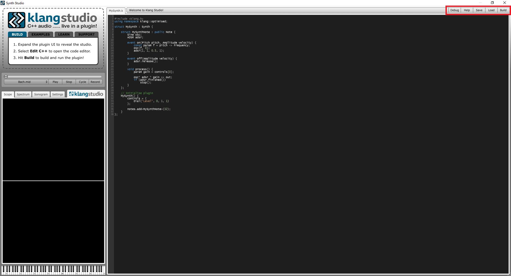
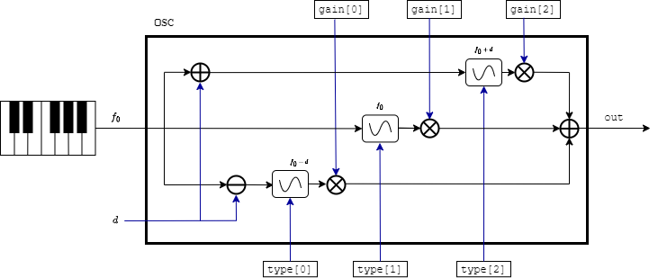
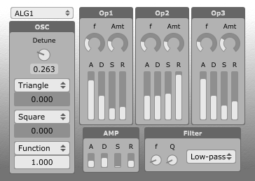
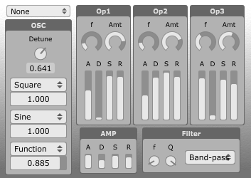
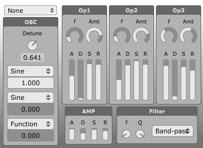
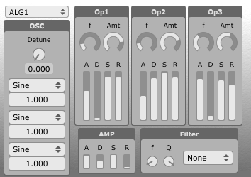
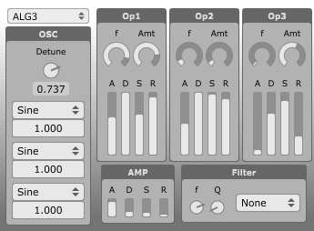
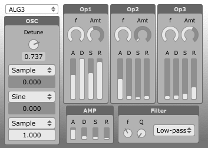

# The FMFlex1 Synthesizer Overview


## The `Op1`, `Op2` and `Op3` blocs
The FMFlex1 is based on FM operator synthesis. An operator consists of an oscillating signal with an envelope applied to it; thus one can see for each operator bloc `Op1`, `Op2` and `Op3` in the FMFlex1, there is a frequency (`f`) parameter and a gain parameter (`Amt`), to setup the oscillating signal; and a set of `A,D,S,R` parameters, to setup the modulating envelope. Reason for this is that I wanted to be able to tune the envelope applied on each oscillator. As ADSR is a type of Envelope, it seemed convenient to use it.

The frequency parameter on `Op1`, `Op2` and `Op3` ranges from 0 to 2 as this is a scale factor applied to the input frequency coming from the keyboard (`f0`). A value of `f=0` therefore sets the frequency of the oscillating signal inside the operator to `0*f0`, while a value of `f=2` sets the frequency of the oscillating signal to `2*f0`.

The Amplitude parameter `Amt` ranges from 0 to 10, and scales the output signal right before leaving the operator.

Each of the `A,D,S,R` parameters range from 0 to 1. They stand for "attack", "delay", "sustain" and "release", respectively, and define different parts of the modulating signal, as shown in the figure below:


The oscillating signal that we set up through `f` and `Amt` can be any type. It can be a Sine wave, or it can be a superposition of three Sine waves, or a superposition of a superposition of three Sine waves, etc. All of this gets decided on the `OSC` bloc (see below). 

The three Operators can be combined together through different operations to give different algorithms. For example, `Op2` can be used to modulate the signal coming out from `Op1` (`op1 >> op2`); the output from `Op1` can be added to the output from `Op2` (`op1 + op2`); or `Op3` can modulate itself while also being modulated by `Op1` (`(op3 << op3) >> op1`).

The current available algorithms are:
* ALG1: `ops[0] >> ops[1] >> ops[2]`;
* ALG2: `ops[0] + ops[1] + ops[2]`;
* ALG3: `(ops[1] >> ops[2]) + ops[0]`; and
* None: No Operators used (output straight from `OSC`).


## The `OSC` bloc
The `OSC` bloc is a signal generator. It generates an output signal by superposing the signals from three different `Oscillators`. If the frequency we setup the `OSC` oscillator to is `f`, then its three composing oscillators are set to vibrate at frequencies `f + d`, `f` and `f-d` (from top to bottom), where `d` stands for the `Detune` parameter. If `d=0`, then all three oscillators are in tuned. The contribution of each `Oscillator` signal to the final `OSC` signal gets set through its corresponding slider, which ranges from 0 to 1. Each of the three `Oscillators` can be set to be of type `Sine`, `Saw`, `Square`, `Triangle`, `Function` or `Sample`. Unlike the `Sine`, `Saw`, `Square` and `Triangle` options, which apply the same type of function regardless of which oscillator they are selected on, the `Function` and `Sample` options can apply different functions depending on which oscillator they are selected on. For instance, selecting the "Function" option on the first Oscillator, can apply the function $$y=x^3 + x^2 -5x+2$$, while  selecting the "Function" option on the third Oscillator can apply the function $$y=3x^4 -x^3+2x^2-7$$. This is because, in the case of the "Function" and "Sample" options, each Oscillator gets setup according to its corresponding `./include/Function_x.txt` or `./include/Sample_x.txt` files, where `x` can be 1, 2 or 3 (corresponding to top, middle and bottom Oscillators). 

### The `Function` option
When selecting the `Function` option on the top Oscillator, the code will setup the Oscillator according to `./include/Function_1.txt`; when selecting the `Function` option on the middle Oscillator, the code will setup the Oscillator according to `./include/Function_2.txt`, and when selecting the `Function` option on the bottom Oscillator, the code will setup the Oscillator according to `./include/Function_3.txt`. 

These files contain the set of (time, amplitude) points used to define their respective `Function`. They must follow the below template:

* Each line in the file must start with a float representing the x-coordinate or time coordinate; followed by a whitespace, and another float representing the y-coordinate or amplitude coordinate. Note the y-coordinate or amplitude must be normalised to unity.
* If $$t$$ is the period of the signal we wish to create and we have $$N$$ points in the `.txt` file, the code will understand $t$ as the difference `points[N].x - points[0].x` (that is, the file should describe only and one full cycle).   

The `Function_1.txt` file of the submitted code defines a triangle wave (and so should sound the same as if selecting "Triangle"); the `Function_2.txt` file defines the function $$f(x)=\sin(\pi x/5)-\tan(2x)$$; and the `Function_3.txt` file defines the function $$f(x)=\ln(x)\cos(15x)$$.

### The `Sample` option
When selecting the `Sample` option on the top Oscillator, the code will setup the Oscillator according to `./include/Sample_1.txt`; when selecting the `Sample` option on the middle Oscillator, the code will setup the Oscillator according to `./include/Sample_2.txt`, and when selecting the `Sample` option on the bottom Oscillator, the code will setup the Oscillator according to `./include/Sample_3.txt`. 

The difference between the `Function` and the `Sample` options is that when selecting the `Function` option, we are generating a signal which shape follows a function (or set of points from a function), while when selecting the `Sample` option, we are generating a signal by superpositing different Sine waves. 

The `Sample_1`, `Sample_2` and `Sample_3` files contain the set of (frequency, loudness) points that the Sine waves need to take in order to generate the desired signal. The file content must be a series of lines; each line in the file starting with a float representing the frequency; followed by a whitespace, and another float representing the loudness (in dB). The first (frequency, loudness) point read on file is taken to be the fundamental frequency of the signal. 

The `Sample_1.txt` file of the submitted code defines (or attempts to define) an organ; the `Sample_2.txt` file defines (or attempts to define) an oboe; and the `Sample_3.txt` file defines (or attempts to define) a guitar.

## The `AMP` bloc
This bloc contains a set of `A, D, S, R` parameters that setup the envelope used to modulate the signal coming out from the algorithm. If the chosen algorithm is "None", then `AMP` is used as the envelope used to modulate the signal coming out straight from `OSC`.

## The `Filter` bloc
This bloc allows to apply either a low-pass, high-pass, a band-pass or no filter to the signal, right before sending it to output. The `f` parameter tunes the threshold or centre frequency, while the `Q` parameter stands for the resonance, indirectly tuning the bandwidth. Higher values of `Q` mean a thinner bandpass:
* For the LPF, a higher `Q` value means we are  turning down more high frequencies;
* For the HPF, a higher `Q` value means we are turning down more low frequencies;
* For the BPF, a higher `Q` value means we are turning down more frequencies below and above the centre frequency.

# The FMFlex1 Synthesizer Code
When launched, Klang Studio will automatically create a `Klang Projects` folder in the `C:/Users/<your-username>/Documents` directory:


The `include` folder mainly contains `.h` or header files, to be imported directly or indirectly on the source files at `src`, which consist mainly of `.k` or klang files. To work on changes to the default code, or to test new code to be added onto existing code, thus I have focussed on these two folders. When testing changes to the files in these directories, I was compiling and building them by pressing the "Build" button on the top right corner on [Klang Studio](https://nash.audio/klang/studio/):



The changes to the default code include:
* changes to the `klang.h` file; mainly, one extra method added to the `Operator` struct to allow calling its internal envelope's `release` method; and the commenting out of `OSCILLATOR::set(+in)` in the `Operator::process` method. All these changes are recorded between lines 4164 and 4180 in `./include/klang.h`.
* one new folder `./include/oscillators/`, containing the three `Sample` and `Function` txt files;
* one new `./include/osc.h` file, containing all new objects used to build the `OSC` struct; and
* the `./src/FMFlex1.k` file.

## The `osc.h` file overview
The `osc.h` file defines the `OSC` struct. The `OSC` struct contains an array of `OSCOscillators`, while each `OSCOscillators` struct contains in itself an array of different `Oscillator` types, including the new `OSCSample` and `OSCFunction` types.

### The `OSC` struct


This is a struct used as the signal generator. It allows to build an input signal out of `OSCSize` derived `Oscillator` types. The derived `Oscillator` types used/allowed in this code are:
* `Sine`, `Saw`, `Square` and `Triangle`;
* `OSCFunction` ("Function" option); and
* `OSCSample` ("Sample" option).

The output signal from `OSC` is the result of superposing the signal from `OSCSize` different `OSCOscillator` objects, each of them scaled from `0.` up to `1.` through `gains` in `./src/FMFlex1.k`. 

It therefore contains a `OSCSize`-size array of `Oscillator` types, where `OSCSize` is (as per submission) set to `3`; and a `OSCSize`-size array of `float` types, to hold the gains for each of the oscillator.

### The `OSCOscillators` struct
This struct holds an array of different `Oscillator` types.
Memory gets directly allocated to all of the possible `Oscillator` options in the `OSC` bloc when constructing the `OSCOscillators`. This is to prevent memory allocation during runtime, and instead move it to compile time. 

The provided code defines a `OSCOscillators` struct with a `OSCOptionSize = 10` array of `std::unique_ptr`s to different derived structs of `Oscillator` type (see lines 163-174 in `./include/osc.h`):
```
    std::unique_ptr<Oscillator> oscs [asynth::OSCOptionSize] = {
        std::make_unique<Sine>(),
        std::make_unique<Saw>(),
        std::make_unique<Square>(),
        std::make_unique<Triangle>(),
        std::make_unique<Wavetable>(OSCFunction(1)),
        std::make_unique<OSCSample>(1),
        std::make_unique<Wavetable>(OSCFunction(2)),
        std::make_unique<OSCSample>(2),
        std::make_unique<Wavetable>(OSCFunction(3)),
        std::make_unique<OSCSample>(3)
    }; 
```

The code will be cleaner if instead we defined two extra structs, say `OSCFunctions` and `OSCSamples`, in a way similar to the below:
```
struct OSCFunctions : public Oscillator {
        private:
            int number{};

            std::unique_ptr<Oscillator> oscs [asynth::OSCSize] = {
                std::make_unique<Wavetable>(OSCFunction(1)),
                std::make_unique<Wavetable>(OSCFunction(2)),
                std::make_unique<Wavetable>(OSCFunction(3)),
            }; 

        public:
            //! Sets the oscillator frequency
            void set (const int& o, param& f) {  
                number = o; oscs[number]->set(f); 
            }
            //! Outputs the specific Oscillator::process()
            void process () { 
                (*oscs[number]) >> out; 
            }

    };
```
and
```
struct OSCSamples : public Oscillator {
    private:
        int number{};

        std::unique_ptr<Oscillator> oscs [asynth::OSCSiz] = {
            std::make_unique<OSCSample>(1),
            std::make_unique<OSCSample>(2),
            std::make_unique<OSCSample>(3)
        }; 

    public:
        //! Sets the oscillator frequency
        void set (const int& o, param& f) {  
            number = o; oscs[number]->set(f); 
        }
        //! Outputs the specific Oscillator::process()
        void process () { (*oscs[number]) >> out; }

};
```
that way, we could have `OSCOscillators` redefined as something similar to the below:
```
struct OSCOscillators : public Oscillator {
    private:
        int type {}; 

        std::unique_ptr<Oscillator> oscs [asynth::OSCOptionSize] = {
            std::make_unique<Sine>(),
            std::make_unique<Saw>(),
            std::make_unique<Square>(),
            std::make_unique<Triangle>(),
            std::make_unique<OSCFunction>(),
            std::make_unique<OSCSample>(),
        }; 

    public:
        //! Sets the oscillator frequency
        void set (const int& o, const int& t, const param& f) { 
            if (t > 3) {
                oscs[type]->set(o, f); 
            }  else {
                oscs[type]->set(f);        
            }  
        }
        //! Outputs the specific Oscillator::process()
        void process () { (*oscs[type]) >> out; }
};
```

However, I did not manage to get this sort of coding working, so I left it as first described.

### The `OSCSample`
The `OSCSample` is a derived type of `Oscillator` which uses additive synthesis to generate a signal. 

The added oscillators are of `Sine` type. Each of them is set to some frequency, and set to contribute certain loudness, according to the set of points provided on the `Sample` txt files at `Klang Projects/include/oscillators/`, as explained before. To avoid dynamic allocation, a `OSCSampleSize`-size array of `std::pair`s gets allocated during compile time. Each `std::pair` stores a `float` (for the frequency) and a `dB`, for the loudness or weight of the `Sine` signal. The size of the array limits the amount of points that can be read from the file. As per submission, `OSCSampleSize` is set to 1000, so that `harmonicSize` $$\overset{!}{<=}$$ `1000`.

# Comments/Improvements/Possible Extensions
* Having `OSCILLATOR::set(+in)` commented out in line 4165 of `./include/klang.h` is not desirable, as this call allows to position (phase) the generated signal according to some input signal. This could be sorted by further methods in `OSC`. Given that all changes in `./include/klang.h` are regarding the `Operator` struct, perhaps a new type of `Operator` should be defined.
* The provided `Function_2.txt` and `Function_3.txt` were generated on Python and currently provided numbers with loads of decimal points on them. This is not desirable, and perhaps the source of certain unpleasant behaviors in the current code, as these numbers are wrapped on `float` when processed. I do not recommend using them. However, I recall the files can be changed as desired and other functions could be put in place. Some interesting settings are displayed below:

 

 

  

* The FMFlex1 synthesizer would benefit from better tuning parameters; as mentioned, changing `Function_2.txt` and `Function_3.txt`, but also maybe `Sample_2.txt`. Maybe adding some effects and a larger variety of possible algorithms.