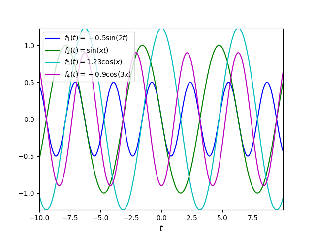
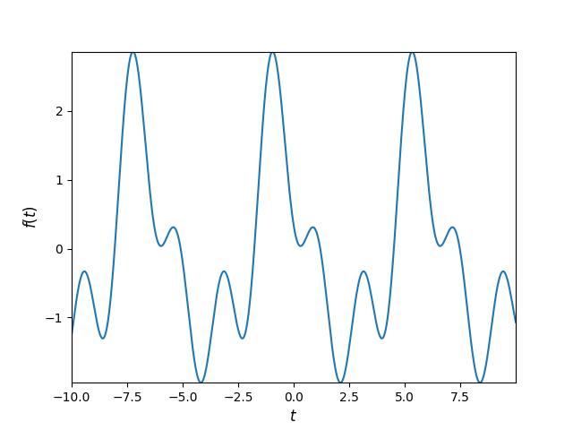
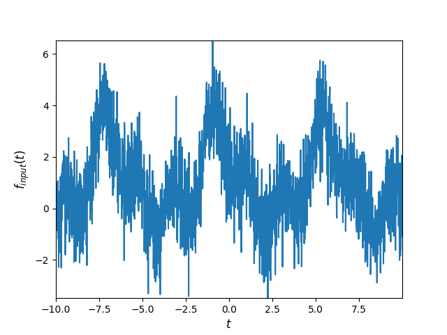
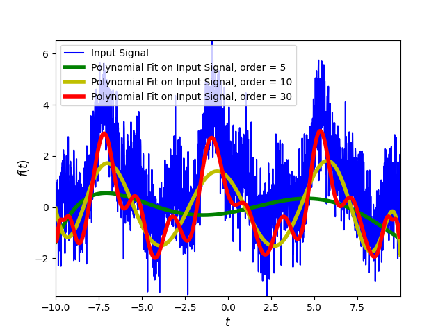
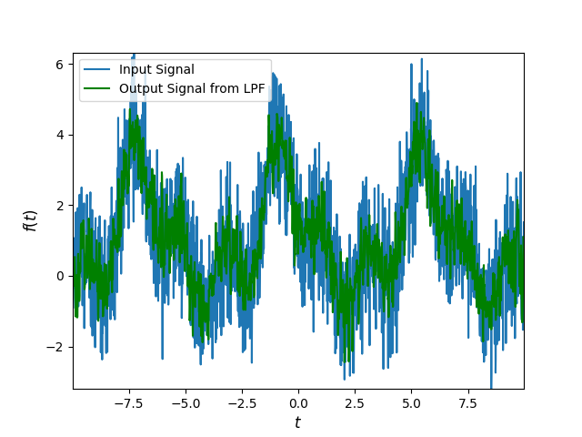
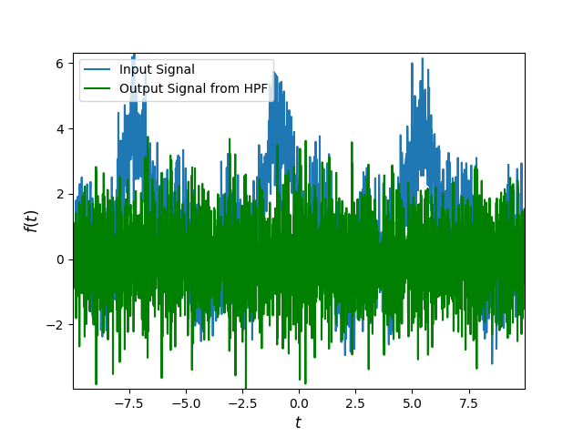

# Filters

When you mix music most times what you'd like to do is just to take certain components of song A to go along other components of song B. For instance, you'd like the bass from song B to go along the vocals from song A. The challenge when mixing is not only to know which different components would go well together, but also how to extract them cleanly from the songs that you know them from. For a while already, the way to more or less separate those components was (and still is in many cases) through filters. Traditional digital filters are used to turn on and off certain frequency ranges within a song[^1].

Recall that periodic waves are characterized by an amplitude, a frequency and perhaps some phase. These waves can be put together (superposed, added together) to make a new wave. Indeed, you can add many waves with different amplitudes, frequencies and phases together and obtain a new wave. This new wave however does no longer consist of one single frequency, but instead contains different frequencies, each of them contributing in different amounts to the wave.

For example, adding together the set of periodic waves displayed on the left results in a new wave, displayed on the right:

A set of sinusoidal waves.             |  New wave resulting from superposing the waves on the left
:-------------------------:|:-------------------------:
  |   

Most real signals are not however like the above figure on the right, but they contain additional noise, so that the input signal through the filter looks rather like:

Many times, we would like to take that noise out of the signal. There are two methods for doing so: the polynomial fit, and the moving average (through, for example, a low-pass filter or LPF).

## The Polynomial Fit to get rid of noise
As shown in the figure below, as we increase the order of the fitting polynomial we get closer and closer to the clean signal from above:

## The Low-Pass Filter to get rid of noise
As mentioned above, a low-pass filter can also get rid of some of the noise. For instance, consider the following expression for a linear filter:

$$
y_t=\sum_{j=-\infty}^{\infty}\beta_jx_{t-j},
$$

where the coefficients $$\beta_j\in\mathbb{R}$$ satisfy the condition:

$$
\sum_{j=-\infty}^{\infty}|\beta_j|<\infty
$$

-- that is, their set is bounded. The collection of $$\beta_j$$ as a function of $$j$$ is called the \textit{impulse response function}. 

Setting the betas so that $$\beta_j=0.4$$, $$\beta_{j-1}=\beta_{j+1}=0.25$$ and $$\beta_{j-2}=\beta_{j+2}=0.05$$ makes up a low-pass filter (LPF). On the other hand, setting the betas so that $$\beta_j=1$$, $$\beta_{j-1}=\beta_{j+1}=-0.5$$ makes up a high-pass filter (HPF). As shown in the figure on the left, passing the input signal through a LPF "cleans-up" the signal. Parallely, passing the input signal through a HPF would only keep its noise, as shown on the right.

LPF                        | HPF
:-------------------------:|:-------------------------:
  |   

[^1]: Nowadays, especially with the uprise of AI, there also exist various different generative models that are able to detect which bits of a song belong to "vocals", "melody", "drums" or "bass". One is even able to download free software, like [Serato DJ](https://serato.com/dj), plug their song in, and in a couple of seconds have their song split into these four _stems_ with reasonably good success.