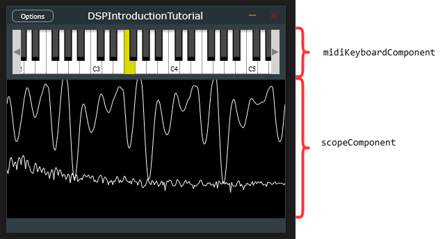
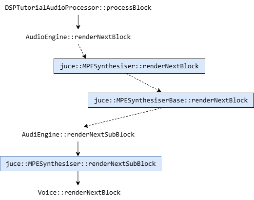
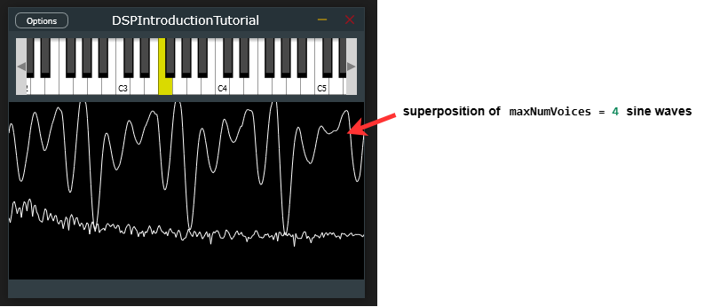
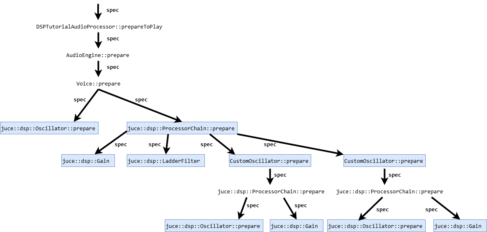
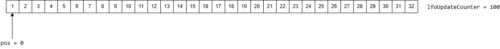
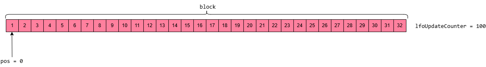
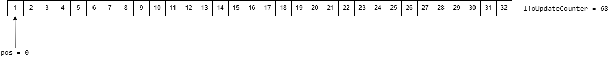
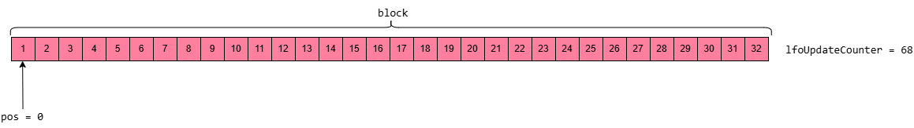
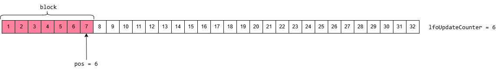
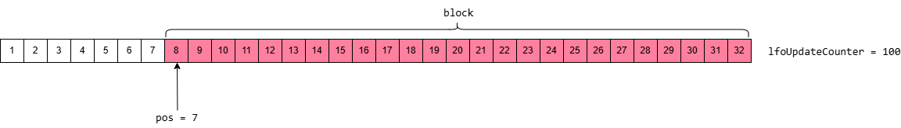

# [Tutorial: Introduction to DSP](https://juce.com/tutorials/tutorial_dsp_introduction/), more explained.

(see https://github.com/cod-salmon/learning-juce/tree/introToDSP for the code referenced below)

The main class in the `DSPIntroductionTutorial_02.h` is the `DSPTutorialAudioProcessor` class.

The `DSPTutorialAudioProcessor` class contains the following private members:
* a `DSPTutorialAudioProcessorEditor` class (it *declares* the class but it does not hold an instance of it; instead, when wanting to access the editor, one can call `DSPTutorialAudioProcessor::createEditor`, which returns a pointer to a newly allocated instance of `DSPTutorialAudioProcessorEditor` in RAM);
* an `AudioEngine` instance called `audioEngine`;
* a `juce::MidiMessageCollector` instance called `midiMessageCollector`;
* an `AudioBufferQueue` of type `float`, called `audioBufferQueue`; and 
* a `ScopeDataCollector` of type `float`, called `scopeDataCollector`.


# The `DSPTutorialAudioProcessorEditor` class
This is a derived class of `juce::AudioProcessorEditor`, which acts as the GUI for the `DSPTutorialAudioProcessor`.
It consists of the following member variables:
* a reference to the `DSPTutorialAudioProcessor` (`dspProcessor`), which is acting as the GUI for;
* an instance of a `juce::MidiKeyboardState` (`midiKeyboardState`), which represents a piano keyboard in code, keeping track of which keys are currently pressed; then
* an instance of a `juce::MidiKeyboardComponent` (`midiKeyboardComponent`), which is the actual component with which the user interacts in the GUI, and which updates `midiKeyboardState`; and
* an instance of a `ScopeComponent` of type `float` (`scopeComponent`),  which is the other component used to display the oscilloscope and frequency spectrums in the GUI:



## The `DSPTutorialAudioProcessorEditor::DSPTutorialAudioProcessorEditor` method
This is the constructor of the `DSPTutorialAudioProcessorEditor` class. First thing we do is to pass on the reference to the `DSPTutorialAudioProcessor` (`p`) to the base class constructor (`AudioProcessorEditor`); then we initialise the `dspProcessor` with the input reference `p`; and we pass the `AudioBufferQueue` from `p` into the `scopeComponent` for processing the data.

This is the constructor, however, so it is mainly focussed on drawing the GUI: when calling `addAndMakeVisible` all we are doing is to add the `midiKeyboardComponent` and `scopeComponent` to the `DSPTutorialAudioProcessorEditor`, which is itself another component for the GUI window alone. Therefore we use `setSize` to set the size of the window. Note that when using `addAndMakeVisible` on a component we want to add to the `DSPTutorialAudioProcessorEditor`, this method automatically places the component on the top left corner. That is why we later need to re-position the `scopeComponent` so that it lies just below the ` midiKeyboardComponent`. Finally, in the `DSPTutorialAudioProcessorEditor`, we add a "listener" to the `midiKeyboardState`: basically, as the user presses and unpressed keys on the `midiKeyboardComponent`, the `midiKeyboardState` changes, and these changes are "listened" or gathered by the "midi message collector". This is the `midiMessageCollector` from the `DSPTutorialAudioProcessor`. It is used during `DSPTutorialAudioProcessor::processBlock`, to use the midi messages to chop up the input  `buffer` into subBlock pieces separated by events in the MIDI buffer, and then call `renderNextSubBlock` on each one of them (see below).


## The `DSPTutorialAudioProcessorEditor::paint` method
In the same way that the `juce::MidiKeyboardComponent` class has implemented its `paint` function so as to draw a piano; the `DSPTutorialAudioProcessorEditor::paint`, draws the `DSPTutorialAudioProcessorEditor` window (to which we add later the `midiKeyboardComponent` and `scopeComponent`). This window we make it resiable and of `backgroundColourId` (black) color. 

## The `DSPTutorialAudioProcessorEditor::resize` method
This method the only thing it does is to tell `DSPTutorialAudioProcessorEditor` what to do in case the user resizes the window.

# The `AudioEngine` class
This is a child class from `juce::MPESynthesiser`. The `juce::MPESynthesiser` extends the `juce::MPESynthesiserBase` class by adding the concept of **voices**. 

One can therefore find methods in the `juce::MPESynthesiser` pertaining to voices, such as `juce::MPESynthesiser::addVoice`, `juce::MPESynthesiser::getNumVoices`, `juce::MPESynthesiser::clearVoices`, etc. A voice in JUCE is an object that generates a sound when triggered by a `juce::MPENote` object. For different sounds, one needs to define different voices. All voices in JUCE are a subclass of the `juce::MPESynthesiserVoice`, which implement their own ways of adapting to changes in pressure, timbre or when the note has just started or stopped being played.

Everything that the `AudioEngine` class does is to keep all these voices (one in this case, defined in the `Voice` class); then indirectly call `Voice::renderNextBlock` everytime `AudioEngine::renderNextSubBlock` gets called, to render sound into an `outputAudio`; then apply a `fxChain` into that `outputAudio`. 

## `AudioEngine::AudioEngine`
Constructs the `AudioEngine` instance by adding `maxNumVoices = 4` `Voice` instances to get sound from. 

## `AudioEngine::prepare`
Calls `prepare` on each of the `Voice` instances, as well as each of the effects in `fxChain`. In the `prepare` method, we pass on a reference to a `juce::dsp::ProcessSpec` object. When passed onto `Voice::prepare`, `spec` specifies the `tempBlock`'s dimensions (`maximumBlockSize`, `numChannels`), as well as the `sampleRate` for the elements in the `processorChain`. It is also passed onto the `prepare` methods of the effects in the `fxChain`. 

## `AudioEngine::renderNextSubBlock`
<div style="text-align: center;">



</div>
When `DSPTutorialAudioProcessor::processBlock` gets called, it takes a reference to a sample buffer (`buffer`) and a midi buffer (`midiMessages`). 
* The sample buffer is a `juce::AudioBuffer`, which stores a sample for every output channel. However, we might have a different number of input channels, so we run the for loop to make sure that the extra output channels are set to zero. 
* The midi buffer is a `juce::MidiBuffer`, which is used to hold a sequence of time-stamped midi events (or `juce::MidiMessage` objects). This gets populated when calling `midiMessageCollector.removeNextBlockOfMessages` and later passed, together with `buffer`, onto `audioEngine.renderNextBlock`.

The `audioEngine.renderNextBlock` method comes from the base `MPESynthesiserBase` class. It takes a reference to the `buffer`, a reference to the `midiMessages`, and two `int` parameters for the `startSample` (set to 0) and `numSamples` (set to the sample size of the `buffer`).

`MPESynthesiserBase::renderNextBlock` chops the provided `buffer` into subBlock pieces, separated by events from the `midiMessages`, and then calls `MPESynthesiserBase::renderNextSubBlock` on each of them. That is why we see `MPESynthesiserBase::renderNextSubBlock` (and not `MPESynthesiserBase::renderNextBlock`) implemented in the `AudioEngine` class.

In the `AudioEngine::renderNextSubBlock` first thing we do is to call each of the voice's `Voice::renderNextBlock` methods and keep adding their rendering into `outputAudio`. At the end of this method, we have some newly rendered sound coming from the voices in the subBlock of length `numSamples` and starting from `startSample` in `outputAudio`. Then we take the same subBlock from `outputAudio` and pass it through the `fxChain` (a `juce::dsp::Reverb`).

# The `Voice` class
This is a subclass of `juce::MPESynthesiserVoice`. It is written so that it allows to play a sine wave when a key is pressed on the keyboard. 

---
**Note**: When `DSPTutorialAudioProcessor::audioEngine`  is constructed during initialisation of the `DSPTutorialAudioProcessor` class, it automatically calls `juce::MPESynthesiser::addVoice` `maxNumVoices = 4` times. That is why, when pressing a key on the keyboard, one does not see a sine wave, but the superposition of four sine waves:


---

## The `Voice::processorChain`
The `juce::dsp::ProcessorChain` class lets you join together any number of processor classes into a single processor which will call `process()` on them all in sequence. The `Voice::processorChain` consists of a sequence of two `CustomOscillator` objects, a `juce::dsp::LadderFilter` and a `juce::dsp::Gain`. 

(The reason for the two oscillators is to add depth to the sound; this is done by setting the second oscillator at a slightly detuned frequency) 

The elements in the `processorChain` are accessed using the method `juce::dsp::ProcessorChain::get<index>()`, where `index` refers to the indexed position of the `Processor`. (**Note**, the word `Processor` in here might mean any class where the `process()` method is implemented).

To ease the reading of the code, instead of using 
* 1 to refer to the first oscillator,
* 2 to refer to the second oscillator,
* 3 to refer to the filter, and
* 4 to refer to the master gain;

we define a nameless `enum` such that
* `osc1Index` maps to 1;
* `osc2Index` maps to 2;
* `filterIndex` maps to 3;
* `masterGainIndex` maps to 4; 

so that we can use these strings instead of numbers throughout the code.

## `Voice::Voice`
In the `Voice` constructor we:
* scale the `masterGain`;
* set the cut-off frequency of the ladder filter (a low-pass filter) to 1000Hz 
* set the `lfo` to a sine wave of frequency 3Hz, from which we take 128 points. **Note**, `lfo` is another oscillator in the `Voice` class. However, this is a  `juce::dsp::Oscillator` instance; instead of a `CustomOscillator` instance, like the two oscillators in `processorChain`. This one, however, works as a low-frequency oscillator used to modulate the cut-off frequency of our (low-pass) filter.

## `Voice::prepare` 
This method gets called on each `Voice` instance when `AudioEngine::prepare` gets called. It takes a reference to a `juce::dsp::ProcessSpec` object, input when calling `DSPTutorialAudioProcessor::prepareToPlay`. This `juce::dsp::ProcessSpec` object is a struct, holding: 
* the `sampleRate` that will be used for the data that is sent to the processor;
* the `maximumBlockSize`, or the maximum number of samples that will be in the blocks sent to the `process()` method; and 
* the `numChannels` that the `process()` method will be expected to handle.
**Note** that in `DSPTutorialAudioProcessor::prepareToPlay` both `sampleRate` and `samplesPerBlock` might be automatically input by the system, no user specification is required. The only thing we specify is the number of channels (two, for the left and right channels).

The `Voice::prepare` method lies within the following flow:


When `Voice::prepare` is called, it triggers the `prepare` methods in both the `processorChain` and the `lfo`. 

Another thing it does is to setup `tempBlock`. `tempBlock` is an instance of a `juce::dsp::AudioBlock<float>`. This object allocates a suitable amount of memory in the heap to store a `spec.numChannels`-size array of channels, each consisting of `spec.maximumBlockSize` samples, and then initialises `heapBlock` to point into it. The `tempBlock` object becomes important in the `Voice::renderNextBlock` method.

## `Voice::renderNextBlock`
The `Voice::renderNextBlock` method takes a reference to the audio `buffer`, and two `int` parameters: `startSample` and `numSample`, which indicate where we want the next new sample to start in the buffer, and the length of such sample.

We will be working on `tempBlock`; then add it onto the subBlock going from `startSample` till `startSample + numSamples` from `outputBuffer`.


First thing we do is to take a reference to the `tempBlock`'s subBlock starting at  0 and finishing at `0 + numSamples`, called `output`. We clear it. Then we loop over each of the sample spaces in that subBlock.

The `lfoUpdateCounter` starts being equal to `lfoUpdateRate = 100` (this is first set during construction of the `Voice` instance). 

For example, let's say that `numSamples = 32`. When we enter the for loop, this is what we have:



Then `max = juce::jmin(32 - 0, 100) = 32` and `block` goes from `0` till `31`.




**Note** that when calling 
```
block.getSubBlock ((size_t) startSample, (size_t) numSamples);
```

`startSample` refers to the index of the element in `output` where the subBlock will start, and then
`numSamples` refers to the number of elements of the subBlock, not the end index.

We initialise `context` with `block`, and then call `process` on the `processorChain` (the two oscillators, the filter and the master gain) with such `context`.

We update `pos += max = 32` and `lfoUpdateCounter -= max = 68`. As we have reached  `pos = numSamples`, the loop finishes. Then we take the `outputBuffer`, get a reference to its suBlock going from `startSample` till `startSample + numSamples - 1`, and add `tempBlock` there. Recall we took a reference (`output`), for the `tempBlock`'s subBlock going from `0` till `numSamples`. From `output`, we took a reference to the subBlock starting from `pos = 0` and with length `max = 32`, and we filled it up with `context`. Therefore, `outputBuffer` gets updated with that `context` data. 

`Voice::renderNextBlock` is called again on `outputBuffer`, from `startSample` till `numSamples`. Again, we get `output` from `tempBlock` as a subBlock to work in. When we enter the for-loop now,  `lfoUpdateCounter = 68`:



`max = juce::min(32 - 0, 68) = 32`; therefore `block` is again:



This is used by `context` and then `context` is passed onto the `processorChain`'s `process`.

`pos += max = 32` and `lfoUpdateCounter -= max = 36`. Because `pos = numSamples`, the for-loop finishes again, and we copy `tempBlock` into `outputBuffer` in the subBlock going from `startSample` till `startSample + numSamples`.

`Voice::renderNextBlock` is called again on `outputBuffer`, from `startSample`, with length `numSamples`. Again, we get `output` from `tempBlock` as a subBlock to work in. When we enter the for-loop now,  `lfoUpdateCounter = 36`, so same thing as before: `max = juce::jmin(32-0, 36) = 32`; then `pos += max = 32` (we finish the loop) and `lfoUpdateCounter -= max = 6`.

`Voice::renderNextBlock` is called again on `outputBuffer`, from `startSample` till `numSamples`. Again, we get `output` from `tempBlock` as a SubBlock to work in. When we enter the for-loop now,  `lfoUpdateCounter = 6`: `max = juce::jmin(32-0, 6) = 6`; then `pos += max = 6`. Hence `block` is length `6`:



We construct a `context` based on `block`, and pass the `context` onto the `processorChain`'s `process`. Then we update `pos += max = 6` and `lfoUpdateCounter -= max = 0`. Because `lfoUpdateCounter = 0`, we reset it to `100` for the next `Voice::renderNextBlock` and then we adjust the cut-off frequency of the low-pass filter from the `processorChain`. Remember the `lfo` is a low-frequency oscillator we use to modulate the cut-off frequency of the LPF. Everytime we call `Voice::renderNextBlock`, the `lfo` moves, and so its returns a different value for `0.0f`, which goes into `lfoOut`. The `lfo` is a simple sine oscillator, so the `lfoOut` ranges from -1 to 1. We want the frequency modulation for the LPF to range between 100Hz and 2000Hz. Therefore we use `juce::jmap` to map `lfoOut` into `cutoffFreqHz`, which is set as the new cut-off frequency of the filter.

Because `pos = 6 != numSamples`, we continue in the loop. In the next iteration, `pos = 7` and `max = juce::min(32 - 7 = 25, 100) = 25`, and therefore `block` is length `25`, starting from `pos = 7`:



We update `pos += max = 32` and `lfoUpdateCounter -= max = 75`. Because `pos` equals `numSamples`, we finish the loop. Finally, we copy the filled-in `tempBlock` where we were rendering, into the `outputBuffer`.

**Note** that `Voice::renderNextBlock` does not share the same path as `AudioEngine::renderNextBlock`. While `Voice::renderNextBlock` calls the `process` methods from the `processorChain` (the two oscillators, the filter and the master gain that make up the voice or sound of our synthesizer), `AudioEngine::renderNextBlock` calls the `process` method from the `fxChain` (the chain of effects that we apply to the sound of our synthesizer; in this case a single `juce::dsp::Reverb`).

# The `AudioBufferQueue` class
This is a class which implements a lock-free queue.

An `AudioBufferQueue` holds two things:
- an array of buffers (`buffers`); and
- an `abstractFifo`, which encapsulates the logic required to implement a lock-free FIFO, and which is initialised to `numBuffers`.

The queue has a limit size:
- The buffer size is set to `bufferSize = 1U << order`. Note `1U << order` equals to `1 * 10^9 = 100000000` in binary, which equals to `512` in decimal.
- The number of buffers is limited to `numBuffers = 5`.

Therefore, `buffers` consists of a `numBuffers = 5`-size array of `512`-size arrays of type `SampleType`.

## The `AudioBufferQueue::push` method
This method is used to push data into the queue. Inputs are `dataToPush` (of type `SampleType` - for instance, `float`), and the size `numSamples` of the data that we want to push into the queue.

First thing we do is to check that the data we want to push into the queue fits the size of the queue (`numSamples <= bufferSize`). Then we use `juce::AbstractFifo::prepareToWrite` to know where to add `dataToPush`. This method gives us two "spaces" where to push `dataToPush` into: "space1", starting at `start1`, and with size `size1`; then "space2", starting at `start2` and with size `size2`. If "space1" is not enough to hold all `dataToPush`, the remaining will be added onto "space2". However, the way the code is written, we should always expect to not need "space2" (hence the assert).

We finally copy `dataToPush` into the array at `buffers[start1]`, and we let FIFO know how much data has been added with `juce::AbstractFifo::finishedWrite`.

## The `AudioBufferQueue::pop` method
This works in a similar way to `AudioBufferQueue::push`. Instead, we use `juce::AbstractFifo::prepareToRead` which returns the location within the buffer from which the next block of data should be read (`start1` with length `size1`). Sometimes "space1" is not enough to fill-in the data for `outputBuffer`, so another "space2", starting at `start2` and with length `size2` is provided. However, as above, the way the code is written, we should always expect to not need "space2" (hence the assert).

We finally read the data from `buffers[start1]` into `outputBuffer`, and we let FIFO know how much data has been consumed with `juce::AbstractFifo::finishedRead`.


# The `ScopeDataCollector` class
This is the class used to process the buffer data and update the `audioBufferQueue`. This is the same `audioBufferQueue` used by the `ScopeComponent` class.

Everytime the `DSPTutorialAudioProcessor::processBlock` method is called, the `ScopeDataCollector::process` method is called on the input `buffer`, and changes in this `buffer` are immediately picked up by the `ScopeComponent::audioBufferQueue`.

It contains:
* a reference to the `audioBufferQueue`, from the `DSPTutorialAudioProcessor`;
* a separate array of type `SampleType` and size `bufferSize`, called `buffer`;
* a `size_t` variable called `numCollected` for tracking how many samples have been gathered from the input `data` into the `buffer`;
* a `SampleType` variable to keep memory of the previous processed sample (set to `100` by default);
* a `SampleType` variable to hold the minimum value at which we consider there was a trigger, the `triggerLevel` (when the current sample we're looking at is greater or equal this `triggerLevel`, then we reset `numCollected` for the starting new event, and change the state to `collecting`); and 
* an `enum class State`, which holds either `waitingForTrigger` or `collecting`.

## The `ScopeDataCollector::process` method
It takes a pointer to the first element in the `data` array of type `SampleType` as well as a `size_t` variable for the array size or `numSamples`.

Now we check the states:
- if we are `waitingForTrigger`, we loop over all samples in `data` and if we find some peak in the `data` (i.e., `currentSample` is greater or equal than `triggerLevel` and `prevSample` was lower than `triggerLevel`), then we make sure `numCollected` is reset to zero and change the state to `collecting`. **Note** this can happen at any point while looping over `data`; so we can change the state to `collecting`and move on unto the "if-`collecting`" block while still processing `data`.
- if we are `collecting`, we either start looping or keep looping over `data`; however in this block we keep adding each sample from `data` into `buffer` until `numCollected` equals the size of the `buffer`. At that point, we push all data gathered in `buffer` into the input `audioBufferQueue` and we reset the state to `waitingForTrigger`.

Therefore, the `audioBufferQueue` keeps receiving data in chunks, each chunk separated by a midi trigger or event (e.g., key pressed or unpressed).

# The `ScopeComponent` class
This is the class used to draw the oscilloscope and frequency spectrum.
The class contains:
* an `audioBufferQueue`,
* an array of type `SampleType` and size `AudioBufferQueue<SampleType>::bufferSize` , called `sampleData`;
* an instance of `juce::dsp::FFT`, called `fft` and with order `AudioBufferQueue<SampleType>::bufferSize = 9`;
* an instance of a `juce::dsp::WindowingFunction<SampleType>` class called `windowFun`. The ``juce::dsp::WindowingFunction` class allows to apply different windowing functions, useful for filter design and spectrum analyzers. In this case, our windowing method is `WindowFun::hann`. This windowing function is applied on the `spectrumData` for pre-processing, before we perform any Fourier transform on it.
* an array of type `SampleType` and two times the size of `AudioBufferQueue<SampleType>::bufferSize`, called `spectrumData`.

## The `ScopeComponent::timerCallBack` method
This method is used to update the `spectrumData`. First thing we do is to take a chunk of data out of the `audioBufferQueue` and put it inside `sampleData`; then we copy that data into `spectrumData`.

Note the `fft` is initialised to be order `AudioBufferQueue<SampleType>::bufferSize = 9`, meaning the number of points it will operate on is `2^9`, or `512` points. Later when we call `juce::dsp::FFT::performFrequencyOnlyForwardTransform` on `spectrumData`, it will need `spectrumData` to be twice the size of the `fft`; hence, the assert.

Then we apply the windowing method, a `hann` function, on the `spectrumdata`, and perform a forward Fourier transform on it, to pass from the real to the frequency domain. From then on, our `spectrumData` holds the frequency response, or magnitude vs. frequency.

Now we want to normalise the `spectrumData`. For each sample, we first check that the gain in decibels of the current sample lies in the range `mindB = -160` and `maxdB = 0`. If so, then we map the sample from the `mindB`-`maxdB` range to the `0-1` range.

After the remapping, we call `repaint`. This does not immediately repaint the graph, but marks the current painting as dirty. The operating system will send a paint message, which will redraw all the dirty regions of all components in some near future. 

## The `ScopeComponent::plot` method
This method is used to draw the plots for both the oscilloscope and the frequency response. For each of the plots, a different `juce::Rectangle` instance is provided to draw on (`scopeRect` or `spectrumRect`). Everything we do in this function is to take those rectangles and draw plots inside them. For both plots, we loop over all samples and we draw a line which connects the previous data plot to the current data plot (this is what basically makes it a line plot vs., for instance, a scatter plot).


