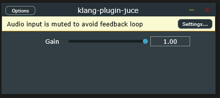
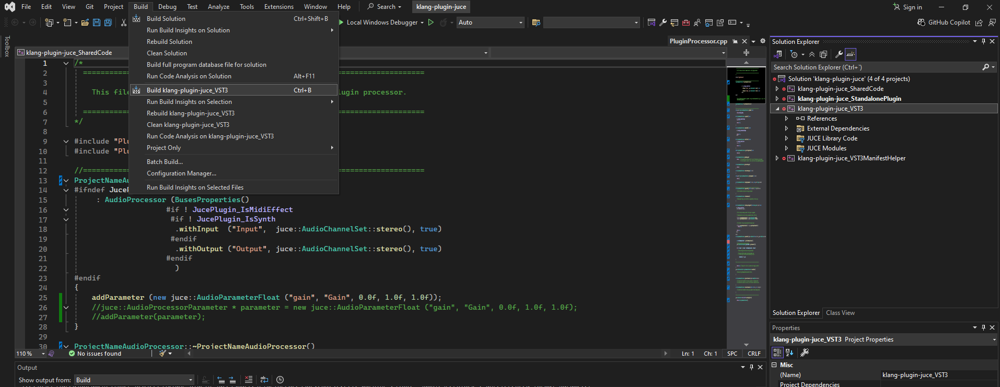
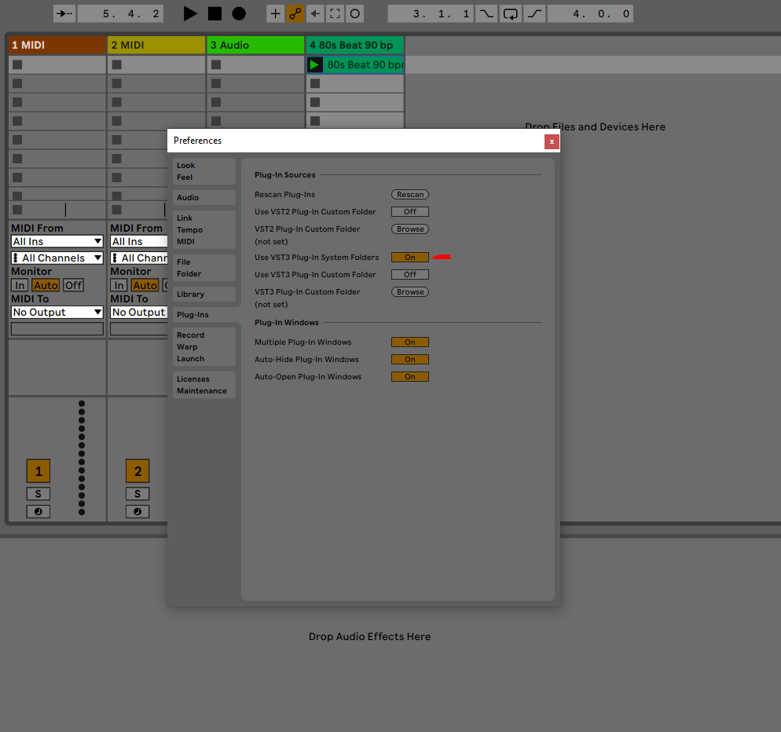
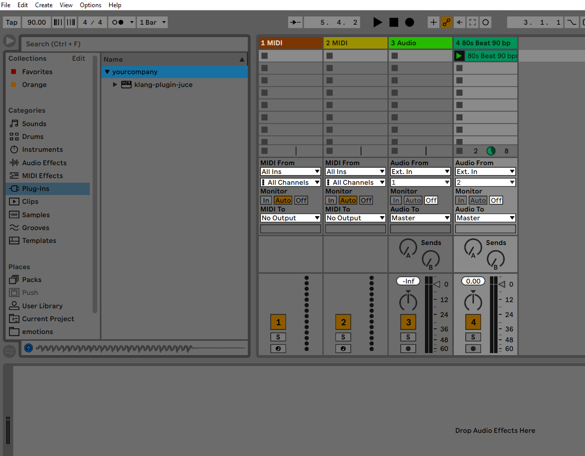
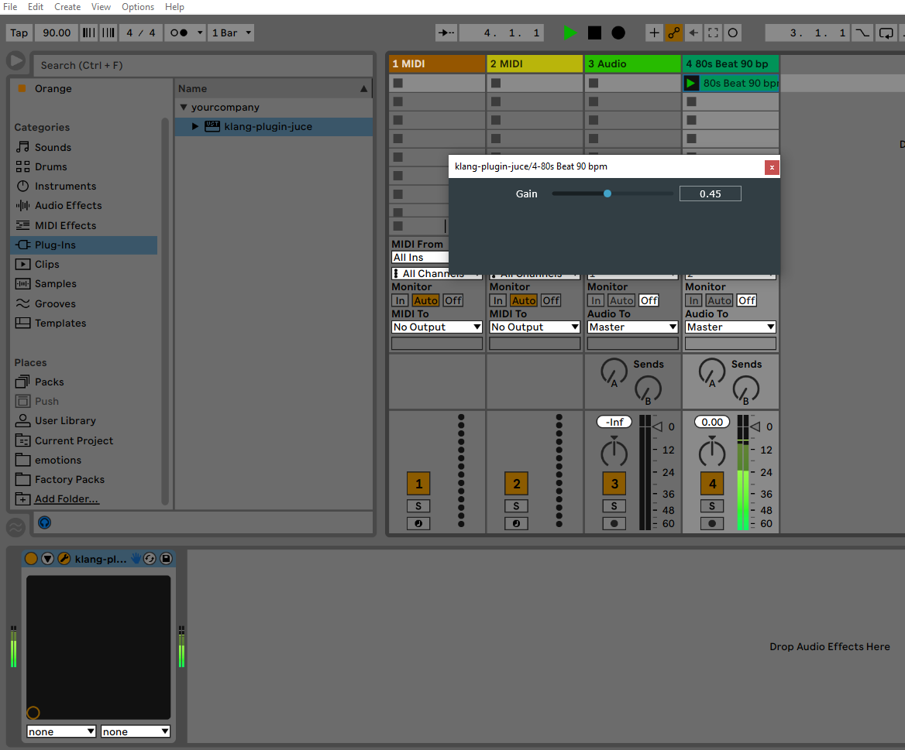
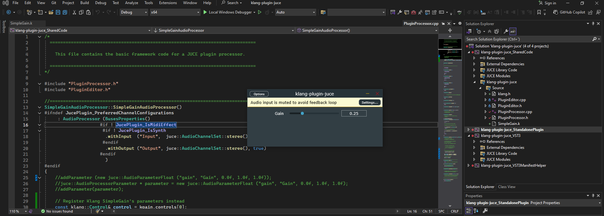
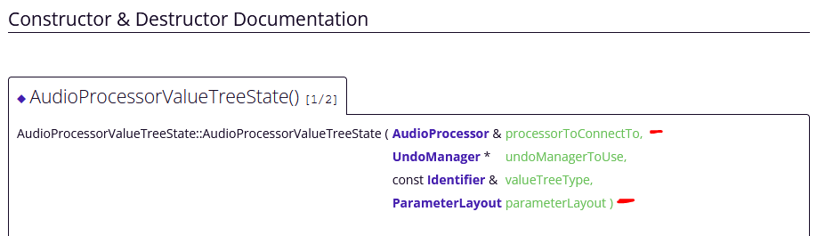
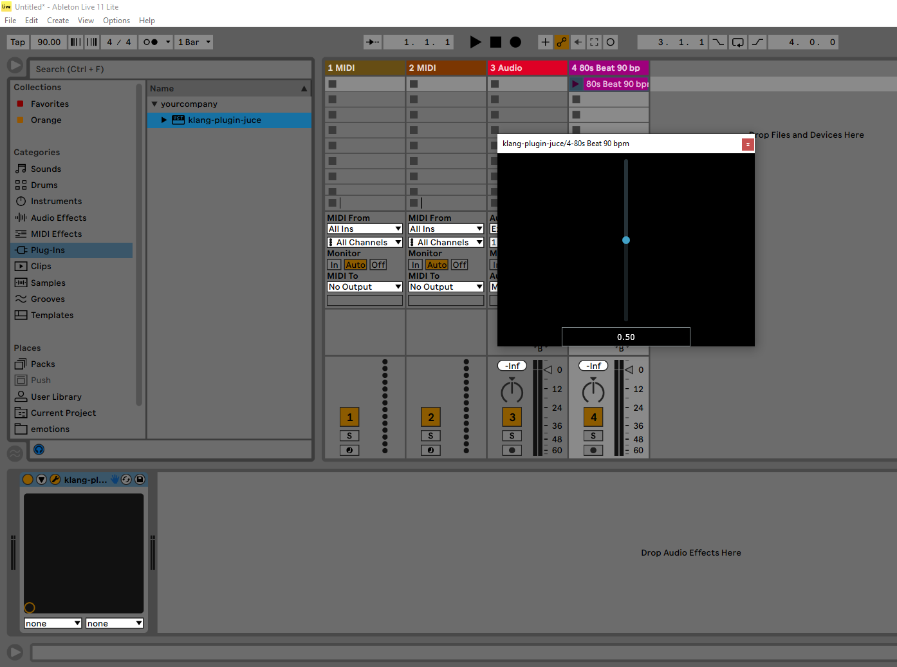

# Simple gain slider
Here I write about how to write a simple gain slider; first, in JUCE; then, in JUCE but through Klang's simple gain dial, defined at `SimpleGain.k`.

## JUCE simple gain slider
When you launch a new Plugin project `SimpleGain` in JUCE, it generates a new folder, where specified, containing the following:
* a `<path>/SimpleGain/Builds` folder
* a `<path>/SimpleGain/JuceLibraryCode` folder
* a `<path>/SimpleGain/Source` folder; and (maybe)
* a `SimpleGain.jucer` file.

The `SimpleGain/Source` folder at the same time comes with the following set of files:
* `PluginEditor.h`
* `PluginEditor.cpp`
* `PluginProcessor.h` and
* `PluginProcessor.cpp`.

The classes will following the naming format (e.g.,) `SimpleGainAudioProcessorEditor`.

### `processBlock`
The actual audio processing is done at `SimpleGainAudioProcessor::processBlock`, which takes a reference to an `AudioBuffer` containing the incoming audio data. `processBlock` modifies this data depending on the type of audio effect desired. An `AudioBuffer` contains floating point audio samples for each of its compounding channels. For instance, for Stereo, we should expect an input `AudioBuffer` consisting of two buffers, for the left and right channels. For instance, the following code lowers the volume down in all input channels:
```
void SimpleGainAudioProcessor::processBlock (juce::AudioBuffer<float>& buffer, juce::MidiBuffer& midiMessages)
{
    // Obtain total number of input channels
    auto totalNumInputChannels  = getTotalNumInputChannels();
    // Loop over each of them
    for (int channel = 0; channel < totalNumInputChannels; ++channel)
    {
        // Obtain the right float chain for the given channel
        float* channelData = buffer.getWritePointer (channel);
        // Loop over the float chain for the given channel, and
        //  for each float in the float chain, multiply it by 0.2.
        for (int i = 0; i < buffer.getNumSamples(); ++i)
            channelData[i] *= 0.2f;
    }
}
```
### Plugin Parameters
Parameters are how plug-in hosts control plug-ins. They are exposed as part of the plug-in format's interface - i.e., you need to specify the parameters in order to specify the plug-in:
```
MyPlugin (parameter1, parameter2, parameter3);
``` 
Parameters can be changed via the plug-in's GUI - you can define the above plug-in in your code, and then have the user through the GUI (say, through some dials) setting up the values for `parameter1`, `parameter2` and `parameter3`. 

In JUCE, parameters are held or wrapped inside the `AudioProcessorParameter` class. This class contains methods for getting and setting the parameter values and properties. Then it can be added to and managed by the AudioProcessor. Some basic types are:
* `AudioParameterFloat`
* `AudioParameterInt`
* `AudioParameterBool`
* `AudioParameterChoice`

Parameters can be added into the plugin by calling `addParameter` in the `SimpleGainAudioProcessor` constructor:
```
SimpleGainAudioProcessor::SimpleGainAudioProcessor()
#ifndef JucePlugin_PreferredChannelConfigurations
     : AudioProcessor (BusesProperties()
                     #if ! JucePlugin_IsMidiEffect
                      #if ! JucePlugin_IsSynth
                       .withInput  ("Input",  juce::AudioChannelSet::stereo(), true)
                      #endif
                       .withOutput ("Output", juce::AudioChannelSet::stereo(), true)
                     #endif
                       )
#endif
{
    // Adds parameter with name "Gain" and ID "gain", with minimum value 0.0f,
    //  maximum value 1.0f, and starting value 1.0f. 
    addParameter (new juce::AudioParameterFloat ("gain", "Gain", 0.0f, 1.0f, 1.0f));
}
```
`addParameter` is a derived method from `AudioProcessor`. `AudioProcessor` keeps an array of `AudioProcessorParameter` pointers, which can be accessed through the method `AudioProcessor::getParameters`. When calling `addParameter(AudioProcessorParameter * parameter)`, what we essentially do is access the xth element in the array of `AudioProcessorParameter` pointers and assign it `parameter`. In the above code, one could instead write:
```
juce::AudioProcessorParameter * parameter = new juce::AudioParameterFloat ("gain", "Gain", 0.0f, 1.0f, 1.0f);
addParameter(parameter);
```
Which element the AudioProcessor decides to access when `addParameter` gets called is (probably) based on some internal variable that keeps track of the last element in the array which has been written into, so that, when `addParameter` gets called the first time, the `parameter` gets assigned to the 0th element in the array; when `addParameter` gets called a second time, the second `parameter` gets assigned to the 1st element in the array; and so on.

To use one of the plug-in's parameters in `processBlock`, we can therefore use the `getParameters` method from the `AudioProcessor` class:
1. by specifying the parameter that we want out of the array of `AudioProcessorParameter` pointers (e.g., `getParameters()[0]` for the first parameter that we added); and
2. by calling `AudioProcessorParameter::getValue` method, which returns the parameter value wrapped inside the `AudioProcessorParameter` class:
```
void SimpleGainAudioProcessor::processBlock (juce::AudioBuffer<float>& buffer, juce::MidiBuffer& midiMessages)
{
    // Obtain total number of input channels
    auto totalNumInputChannels  = getTotalNumInputChannels();

    // Obtain the value for the gain parameter
    juce::AudioProcessorParameter* gainParameter = getParameters()[0];
    float gain = gainParameter->getValue();
    // Loop over each of them
    for (int channel = 0; channel < totalNumInputChannels; ++channel)
    {
        // Obtain the right float chain for the given channel
        float* channelData = buffer.getWritePointer (channel);
        // Loop over the float chain for the given channel, and
        //  for each float in the float chain, multiply it by 0.2.
        for (int i = 0; i < buffer.getNumSamples(); ++i)
            channelData[i] *= gain;
    }
}
```
### `GenericAudioProcessorEditor`
To be able to see this simple gain knob in action, we don't even need to enter into GUI details and start playing around `SimpleGainAudioProcessorEditor::paint` and `SimpleGainAudioProcessorEditor::resize` (see `./PluginEditor.h` and `./PluginEditor.cpp`). There is this short-cut that we can take. Instead of having:
```
juce::AudioProcessorEditor* SimpleGainAudioProcessor::createEditor()
{
    return new SimpleGainAudioProcessorEditor (*this);
}
```
we can use an automatically-generated graphic interface:
```
juce::AudioProcessorEditor* SimpleDelayAudioProcessor::createEditor()
{
    //return new SimpleDelayAudioProcessorEditor (*this);
    return new juce::GenericAudioProcessorEditor (*this);
}
```
which will look at the AudioProcessor that you pass to it, it will look at the types of parameters that you registered in the Audioprocessor and then decide and build for you the right interface for them (for example, it might build a slider for the gain parameter). The code up in branch `SimpleGain`, up to the commit with number `0ac42b1` will show the following plug-in GUI:



To test the plug-in in Ableton I do the following:
1. Build the VST3 file on JUCE:
     
2. Go to  `C:\<path>\JUCE-projects\klang-plugin-juce\Builds\VisualStudio2022\x64\Debug\VST3\klang-plugin-juce.vst3\Contents\x86_64-win`, copy the `klang-plugin-juce.vst3` file and bring it into `C:\Program Files\Common Files\VST3`:
    
3. Tell Ableton to look into that folder for plug-ins:
    
4. Add plug-in into a random sample:
     

## JUCE simple gain slider through [Klang](https://github.com/nashaudio/klang)
In branch `klang-plugin-juce/SimpleGain`, commit `e4969cc`, I managed to have the same gain slider described above running through Klang.

### Changes in the `PluginProcessor.h`
We include `klang.h`, which enables us to use the Klang language inside JUCE, using their common C++ framework; and we include `SimpleGain.k`, which implements a Gain dial with minimum value of 0.0f, maximum value of 2.0f and default value of 0.25f. Then we add a `SimpleGain` instance called `kgain` as a new member variable of the `SimpleGainAudioProcessor` class.
### Changes in the `SimpleGainAudioProcessor` constructor
Instead of defining the values inside the constructor, we retrieve the parameter values from `kgain`'s Klang `Controls`:
```
//addParameter (new juce::AudioParameterFloat ("gain", "Gain", 0.0f, 1.0f, 1.0f));
//juce::AudioProcessorParameter * parameter = new juce::AudioParameterFloat ("gain", "Gain", 0.0f, 1.0f, 1.0f);
//addParameter(parameter);

// Register Klang SimpleGain's parameters instead
const klang::Control& control = kgain.controls[0];
addParameter(new juce::AudioParameterFloat(0, control.name.c_str(), control.min, control.max, control.initial));
```

### Changes in the `processBlock`
We don't want to process the input audio in JUCE, but we want JUCE to pass the input audio to Klang, so that it processes it accordingly. Therefore we write:
```
void SimpleGainAudioProcessor::processBlock (juce::AudioBuffer<float>& buffer, juce::MidiBuffer& midiMessages)
{
    /* // Obtain total number of input channels
    auto totalNumInputChannels  = getTotalNumInputChannels();

    // Obtain the value for the gain parameter
    juce::AudioProcessorParameter* gainParameter = getParameters()[0];
    float gain = gainParameter->getValue();
    // Loop over each of them
    for (int channel = 0; channel < totalNumInputChannels; ++channel)
    {
        // Obtain the right float chain for the given channel
        float* channelData = buffer.getWritePointer (channel);
        // Loop over the float chain for the given channel, and
        //  for each float in the float chain, multiply it by 0.2.
        for (int i = 0; i < buffer.getNumSamples(); ++i)
            channelData[i] *= gain;
    } */

    // Update the Klang Synth's parameters (may have changed)
    for (unsigned int c = 0; c < kgain.controls.size(); c++)
        kgain.controls[c].set(getParameters()[c]->getValue());

    // Setup the buffers for processing in Klang
    klang::buffer left(buffer.getWritePointer(0), buffer.getNumSamples());
    klang::buffer right(buffer.getWritePointer(1), buffer.getNumSamples());
    
    // Process buffers in Klang's SimpleGain
    kgain.klang::Effect::process(left);
    kgain.klang::Effect::process(right);
}
```

One should now be able to use a Gain slider in Ableton (following the process described above) that goes from 0.0f to 2.0f and defaults to 0.25f:




# JUCE simple gain slider with `AudioProcessorValueTreeState`

Before, in the `SimpleGain` branch at commits `0ac42b1` and `e4969cc`, we were using an automatically generated GUI - i.e., in `PluginProcessor.cpp` we would have:
```
juce::AudioProcessorEditor* SimpleDelayAudioProcessor::createEditor()
{
    //return new SimpleDelayAudioProcessorEditor (*this);
    return new juce::GenericAudioProcessorEditor (*this);
}
```
However, when we don't want the generic editor, we can use our own `SimpleDelayAudioProcessorEditor`. That's when we need to modify the `PluginEditor.h` and `PluginEditor.cpp` files. In these, we will keep the GUI components and a way of linking them to our parameters in the `PluginProcessor` files.

## The [`AudioProcessorValueTreeState`](https://docs.juce.com/master/classAudioProcessorValueTreeState.html#details) class
It is common to find an additional  `AudioProcessorValueTreeState` instance as a member variable of the AudioProcessor class (like our `SimpleGainAudioProcessor`). This `AudioProcessorValueTreeState` instance keeps track of the processor's state and all the parameters that control it. Therefore, one mainly needs to specify (1) the audio processor and (2) the `ParameterLayout` in order to specify the `AudioProcessorValueTreeState` instance:


The `ParameterLayout` is simply a class within the `AudioProcessorValueTreeState` that allows to keep a collection of `RangedAudioParameters` together, so that they can be passed onto the `AudioProcessorValueTreeState` constructor. Note that all the `AudioParameterFloat`, `AudioParameterInt`, `AudioParameterBool` and `AudioParameterChoice` are `RangedAudioParameter`-derived classes.

One example on how to instantiate a `ParameterLayout` instance is:
```
juce::AudioProcessorValueTreeState::ParameterLayout layout = { 
    std::make_unique<AudioParameterFloat> ("a", "Parameter A", NormalisableRange<float> (-100.0f, 100.0f), 0),
    std::make_unique<AudioParameterInt> ("b", "Parameter B", 0, 5, 2) 
}
```

A way of passing a `ParameterLayout` instance onto the `AudioProcessor` constructor is by implementing a `createParameterLayout` method within the `AudioProcessor` class that would `add` the parameters into a layout and return it afterwards:
```
AudioProcessorValueTreeState::ParameterLayout createParameterLayout()
{
    AudioProcessorValueTreeState::ParameterLayout layout;
 
    for (int i = 1; i < 9; ++i)
        layout.add (std::make_unique<AudioParameterInt> (String (i), String (i), 0, i, 0));
 
    return layout;
}

YourAudioProcessor()
    : apvts (*this, &undoManager, "PARAMETERS", createParameterLayout())
{
}

```
Another way is by explicitly initialising the layout everytime the `AudioProcessor` constructor gets called:
```
YourAudioProcessor()
    : apvts (*this, &undoManager, "PARAMETERS",
             { std::make_unique<AudioParameterFloat> ("a", "Parameter A", NormalisableRange<float> (-100.0f, 100.0f), 0),
               std::make_unique<AudioParameterInt> ("b", "Parameter B", 0, 5, 2) })
```
For the changes in the branch `SimpleGain` in commit `13da038`, that is what we do:
```
SimpleGainAudioProcessor::SimpleGainAudioProcessor()
#ifndef JucePlugin_PreferredChannelConfigurations
     : AudioProcessor (BusesProperties()
                     #if ! JucePlugin_IsMidiEffect
                      #if ! JucePlugin_IsSynth
                       .withInput  ("Input",  juce::AudioChannelSet::stereo(), true)
                      #endif
                       .withOutput ("Output", juce::AudioChannelSet::stereo(), true)
                     #endif
                       ), apvts (*this, 
                                 nullptr, 
                                 "STATE", 
                                 {std::make_unique<juce::AudioParameterFloat> ("gain", "Gain",  0.0f, 1.0f, 0.5f)}
                                )
#endif
{   
}
```
Now everytime the `SimpleGainAudioProcessor` constructor gets called, it initialises its `AudioProcessorValueTreeState` instance with name `apvts`, to contain an `AudioParameterFloat` called "Gain", with parameter ID "gain", with minimum value of 0.0f, maximum value of 1.0f and defualt value of 0.5g. Note, the `apvts` instance has been declared as a public member variable of the `SimpleGainAudioProcessor` class.

## The `AudioProcessorValueTreeState::SliderAttachment` class
Among other classes defined within the `AudioProcessorValueTreeState` are the "attachments": `SliderAttachment`, `ComboBoxAttachment` and `ButtonAttachment`. These classes are there to link GUI components to the parameters in the `AudioProcessorValueTreeState`. For instance, a `SliderAttachment` maintains a connection between a `Slider` and a parameter in the `AudioProcessorValueTreeState`. To specify a `AudioProcessorValueTreeState::SliderAttachment` thus, one needs: a reference to the `AudioProcessorValueTreeState`, the parameter ID for the parameter that we wanna link; and finally, a reference to the `Slider` instance that we want to link the parameter to. 

While the `AudioProcessorValueTreeState` instance resides within the `AudioProcessor` class, the attachment (i.e., a `AudioProcessorValueTreeState::SliderAttachment` instance called `gainSliderAttachment`) is placed inside the `AudioProcessorEditor` class, together with the GUI component (i.e., a `Slider` instance called `gainSlider`). This is important, as the  `SliderAttachment` links the `Slider` to the gain parameter in the `apvts`. We must make sure that the lifetimes of both `gainSlider` and `gainSliderAttachment` are the same and that, when destroyed, the link maintained through `gainSliderttachment` disappears before the objects that it links.

The `gainSliderAttachment` instance gets initialised during the construction of the `SimpleGainAudioProcessorEditor` (which, at the same time, gets called in the `SimpleDelayAudioProcessor::createEditor` method):
```
SimpleGainAudioProcessorEditor::SimpleGainAudioProcessorEditor (SimpleGainAudioProcessor& p)
    : AudioProcessorEditor (&p), audioProcessor (p), 
    gainSliderAttachment (p.apvts, "gain", gainSlider)
{
    gainSlider.setSliderStyle (juce::Slider::SliderStyle::LinearVertical);
    gainSlider.setTextBoxStyle (juce::Slider::TextBoxBelow, true, 200, 30);
    addAndMakeVisible (gainSlider);
    
    // Make sure that before the constructor has finished, you've set the
    // editor's size to whatever you need it to be.
    setSize (400, 300);
}
```
In the `SimpleGainAudioProcessorEditor` we also set the style of our `gainSlider`. In this case, we want the slider to be vertical and have a text box below showing the value of the gain.

Finally, we implement the `SimpleGainAudioProcessorEditor::paint` and `SimpleGainAudioProcessorEditor::resized` method a little so that (1) we set the gain slider to take up the whole GUI window, and (2) set its background color to black.



## Setting and retrieving the audio processor's state
Once we have a `AudioProcessorValueTreeState` instance in our `AudioProcessor` class, we can implement the  `AudioProcessor::setStateInformation` and `AudioProcessor::getStateInformation` methods. These allow the user to save the plugin's state once he/she is happy with the settings; and similarly, to initialise the plugin with the saved settings when restarting a session. The `AudioProcessor::getStateInformation` is passed a reference to a `MemoryBlock` called `destData`. This is where the `AudioProcessorValueTreeState` data is copied onto. Reversely, in `AudioProcessor::setStateInformation`, a bunch of `data` of size `sizeInBytes` is converted into Xml, and from Xml, a new `AudioProcessorValueTreeState` is obtained to replace the current `AudioProcessorValueTreeState`:
```
void SimpleDelayAudioProcessor::getStateInformation (juce::MemoryBlock& destData)
{
    // Takes the AudioProcessorValueTreeState instance that we declared 
    //  in the AudioProcessor's class and passes its data onto destData
    if (auto xmlState = apvts.copyState().createXml())
        copyXmlToBinary (*xmlState, destData);
}

void SimpleDelayAudioProcessor::setStateInformation (const void* data, int sizeInBytes)
{
    // Gets pointer to "data" and its size "sizeInBytes", converts it into Xml
    //  and from Xml, we obtain a new AudioProcessorValueTreeState with which
    //  to replace our current AudioProcessorValueTreeState state.
    if (auto xmlState = getXmlFromBinary (data, sizeInBytes))
        apvts.replaceState (juce::ValueTree::fromXml (*xmlState));
}
```