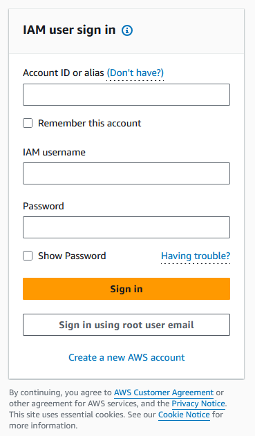
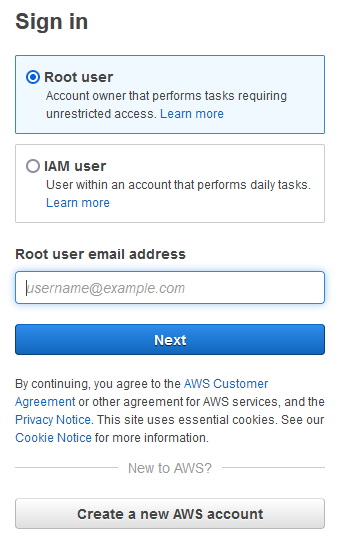
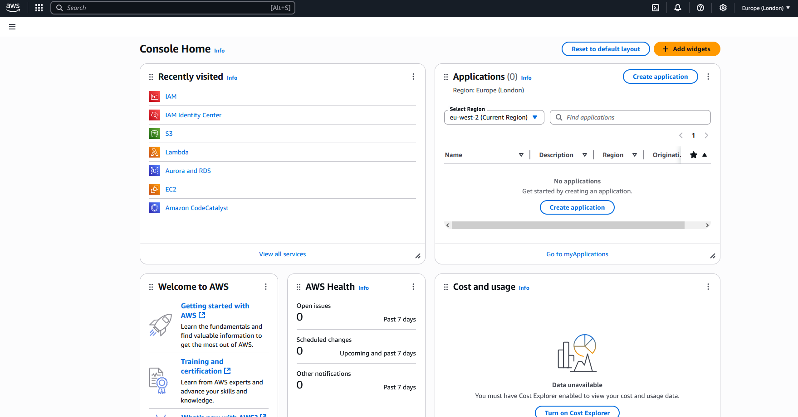
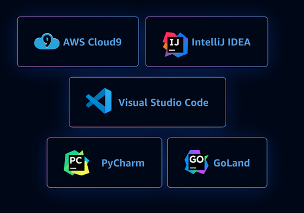
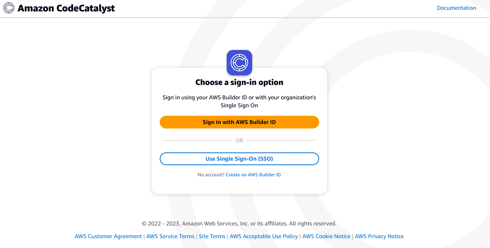
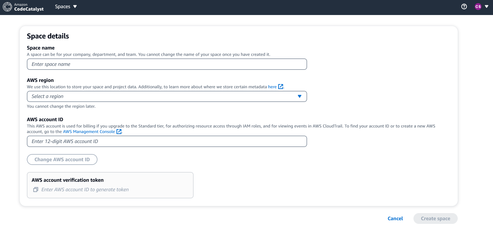
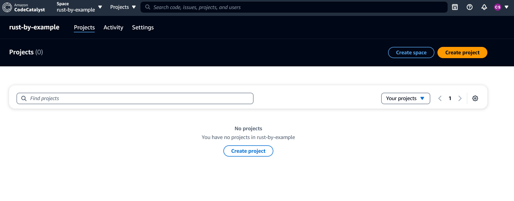

### Content in progres...

# AWS IAM
When you create an AWS account, you begin with one sign-in identity that has complete access to all AWS services and resources in the account. This identity is called the AWS account [**root user**](https://docs.aws.amazon.com/IAM/latest/UserGuide/introduction.html). The AWS account can however have multiple other users interacting with its resources. 

AWS Identity and Access Management (IAM) is a web service that helps you control the access that each of these users has on your AWS account resources.

AWS strongly recommends to not use the root user for your everyday tasks. Safeguard your root user credentials and use them to perform the tasks that only the root user can perform. This is why, when signing in to [AWS](https://aws.amazon.com/) you are by default asked to provide you IAM user credentials. However, you can also click on "Sign in using root user email" to login as root user on the AWS account

  

# AWS CLI
Your AWS account gives you access to various different AWS services (EC2, S3, Amazon Lightsail, Amazon CodeCatalyst, etc.). You can interact with those services via the web-based [AWS Management Console](https://docs.aws.amazon.com/awsconsolehelpdocs/latest/gsg/what-is.html) (see below), or via commands, by installing `aws-cli` or [AWS Command Line Interface](https://docs.aws.amazon.com/cli/latest/userguide/cli-chap-welcome.html) in your command-line shell.




# Amazon CodeCatalyst
There is a large amount of AWS services that are related to building, managing or deploying software projects on AWS. One of them is [**Amazon CodeCatalyst**](https://codecatalyst.aws/explore/dev-environments), released on 2022.

Amazon CodeCatalyst is a unified **software development service** that makes it easy for development teams to quickly build and deliver scalable applications on AWS, while adhering to organizational best practices.

There you have:
1. A Dev Environment. This is automatically created with pre-installed dependencies and language-specific packages so you can work on a new or existing project right away.
2. An IDE from which you can launch the cloud development environment (you can also launch it from CodeCatalyst) - an integrated dev environment or IDE is basically your portal into the dev environment -. Options are:



Basically:

- Visual Studio Code
- AWS Cloud9
- or any of the available JetBrains IDEs: IntelliJ IDEA, GoLand and PyCharm.


First thing is to sign into Amazon CodeCatalyst:


Once signed in, it will ask you to create some "space", and within that space, to create some "project".




I want to use CodeCatalyst to run the codes in [Rust By Examples](https://doc.rust-lang.org/stable/rust-by-example/), so I created a space called "rust-by-example" (a "space" in CodeCatalyst may be run collaborately by multiple members, but in this case is just me :). Then we are asked to create a project, and so I create "hello-world", for the first example in the website. Note, each project may consist of more than one source repository. The repo provider may be, for example, Github, or Amazon CodeCatalyst itself. If Github (/Gitlab/Bitbucket), we shall need to link the repository from that account to the Amazon CodeCatalyst account. If the code repo comes from Amazon CodeCatalyst, the repo will be already assigned to an IDE (from the IDE selection mentioned above). If you want to switch IDE, then you need to create a new code repository.

The good thing about having a Amazon CodeCatalyst repository, is that this can then be opened in one of the IDEs mentioned above.  

# Project: Use the AWS SDK for Rust to connect to Amazon S3 and list the buckets in an account 
To connect to Amazon S3 and list buckets using Rust, you can use the AWS SDK for Rust. This can be imported through the `aws-sdk-s3` crate. To use it in your project, you can add the following dependencies to the `Cargo.toml` file:
```
[dependencies]
aws-config = { version = "1.0.1", features = ["behavior-version-latest"] }
aws-sdk-s3 = { version = "1.4.0" }
tokio = { version = "1.20.1", features = ["full"] }
```